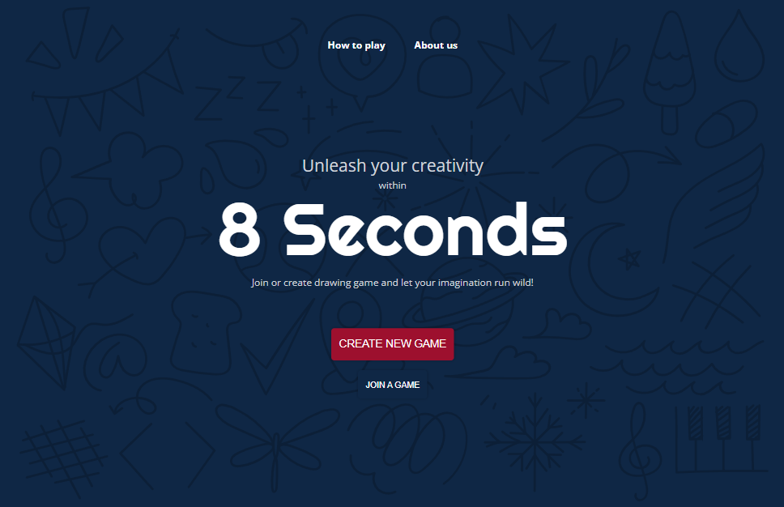
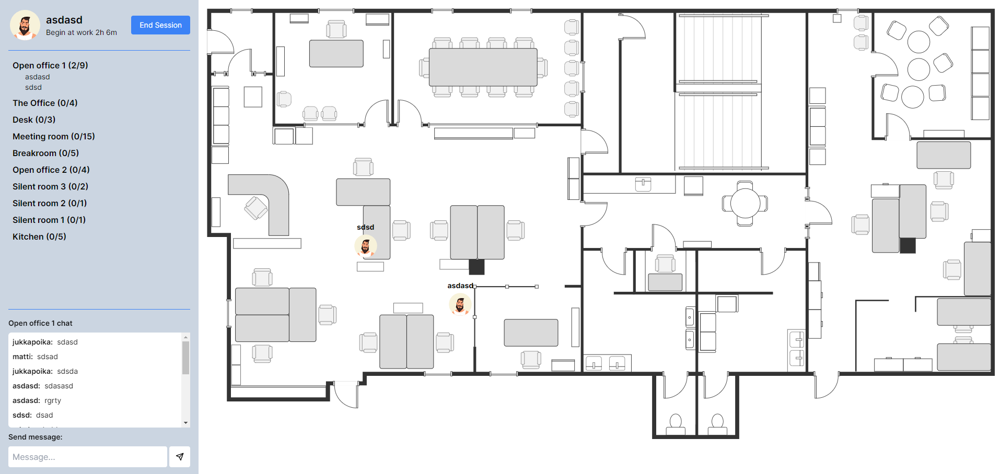
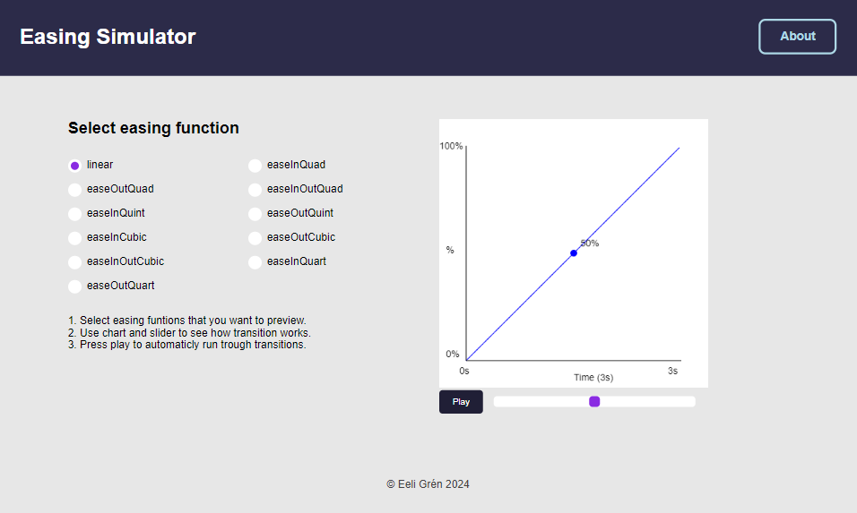
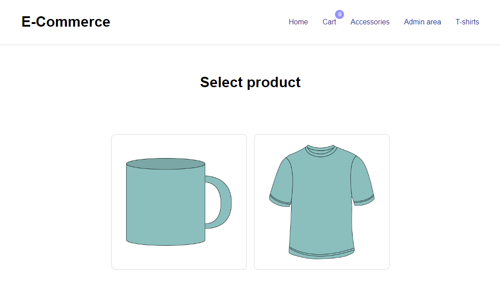
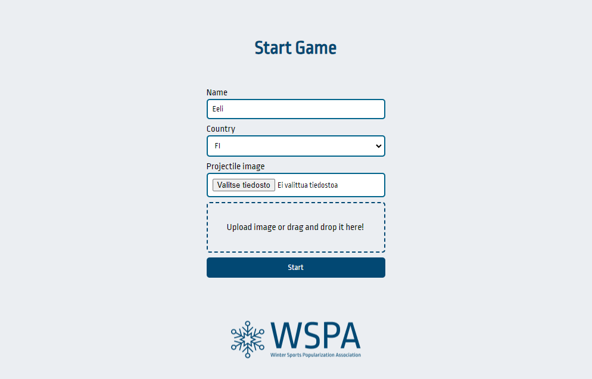
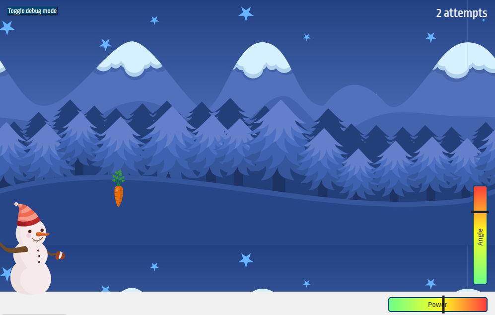
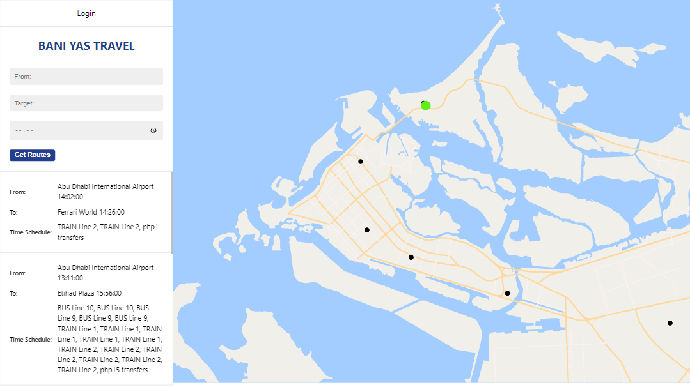
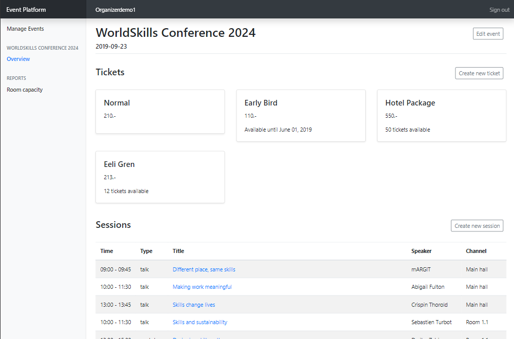
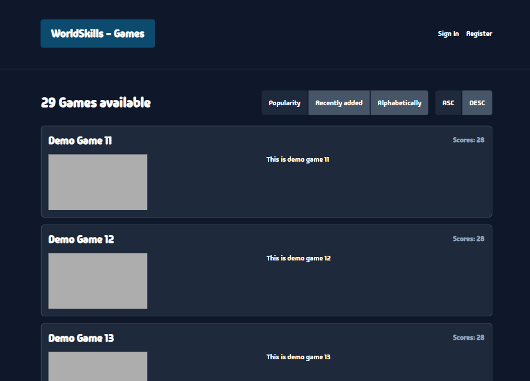

# My WorldSkills Lyon 2024 journey

Here's a summary of my training journey for the WorldSkills 2024 web development competition in Lyon, along with a list of tasks and projects I've completed as part of the training in 2024.

## Journey in numbers

- Over 460 hours dedicated training
- +32 different sizes projects (React & Laravel)
- 3 official training competitions (Hungarian ES2025 qualification, Taitaja2024 and UWDC2024)
- ~80 small tasks "speedtests" (JS, HTML/CSS, vanilla PHP)

## What have i learned?

- Mastering Laravel on deeper WorldSkills level in one year without even knowing first what it is!
- A deeper undestranding of React (Vite)
- A better understanding of wireframe and web design principles
- HTML/CSS tricks and time-saving techniques
- Writing tests with Cypress & PHPUnit
- Using CI/CD pipelines and writing secure automated deployment flows
- Docker usage in web-development
- Stress and time management
- A more professional approach to everything

# Projects

Here is a list of some of the projects I have completed during this journey.

**All of them were made without access to the internet or any generative AI.**

## Online multiplayer drawing game

- **From**: UWDC2024
- **Time**: 7h

Description: In UWDC2024, your task is to build a collaborative drawing game designed to offer a fun and engaging experience. Players can choose between two game modes: Freehand, where they draw based on a random word with 8-second turns, and Tracing, where they replicate a random SVG image as accurately as possible. You are also responsible for building the landing page UI, ensuring it matches the provided design and style guidelines consistently across all pages.

## Virtual office

- **From:** UWDC2023
- **Time:** 6h

**Description:** After the pandemic, many companies adopted remote work, but employees felt isolated. To address this, XOXO is developing a virtual office. Your task is to create an MVP for a virtual office web application that shows employees' avatars in real-time. The theme is based on The Office TV show. You will be provided with a pre-defined office layout as a background, and your task is to add selectable areas where users can be assigned. The application must update this information in real-time using WebSockets or AJAX.

Users can:
- Start and end session.
- See session length.
- Choose and change avatar from predefined avatars.
- See a real-time list of all rooms/zones and participants in each room/zone.
- See the virtual office layout with the logged-in users' avatars.
- Enter and leave rooms/zones.
- Chat with people in the same room.

## Easing functions visual simulator

- **From:** EuroSkills 2018
- **Time:** 6.5h

**Description:** The project involves creating a single-page web application that serves as an easing function simulator, featuring functions like Linear, Ease-out, Ease-in, and more, based on available JSON data. The page layout includes a header, main area, and footer, and must be responsive for both desktop and mobile screens. The main area consists of three parts: options for easing functions, a simulation chart, and a slider. Users can select easing functions, which are reflected in real-time on the chart. The application must accommodate randomized elements such as the target audience, JSON data, and the behavior of the "About" panel, which will vary depending on the screen size and the day of the competition.

## E-commerce website and admin dashboard

- **From:** EuroSkills 2018
- **Time:** 6.5h

**Description:** The project involves creating an online pre-order website to sell personalized t-shirts and accessories. The site has a public-facing page for customers to choose design symbols and products, and an admin area for managing orders and design symbols. The public page includes a mobile-friendly layout with options for selecting products, colors, and adding items to a cart for pre-ordering. The checkout process is implemented in PHP, storing order details in a database. The admin area allows managing navigation, uploading design symbols, and handling pre-orders with status updates. The website must meet HTML5, CSS, and PHP standards and focus on usability and performance.

## Snowman 2.0 throw game

- **From:** UWDC2021
- **Time:** 6h

**Description:** The project involves developing an online game for the Winter Sports Popularization Association (WSPA), where the hero, The SnowMan 2.0, participates in a snowball throwing battle. Players throw a projectile as far as possible, controlling the angle and power of the throw. The game must be compatible with both desktop and mobile devices, using correct WSPA brand colors and logo. It should include responsive game controls, sound effects, and visual indicators for distance and throwing parameters.

Players start by entering their name, selecting a country code, and optionally uploading a custom projectile image. The game is controlled via keyboard on desktops and touch on mobiles. Key moments, such as throws and bounces, are recorded in a database via API calls. After three attempts, the game ends, and the player's average score of the top two throws is calculated. A leaderboard displays the top five players, highlighting the current player if applicable.

## Restaurant table reserving API

- **From:** WorldSkills 2015
- **Time:** 3h

**Description:** WorldSkills International plans to create a web application to manage reservations for the Restaurant Service competition. The application must accommodate both individual and group bookings and align with the WorldSkills brand. Four dining modules—Casual Dining, Bar Service, Fine Dining, and Banquet Dining—are offered, each with specific seating times and configurations. The system should display real-time availability and allow full seating bookings. A restriction is in place to ensure no more than 30 guests from the same country are seated together to avoid guests sitting at a table served by a Restaurant Service Competitor from their own country. Bookings are subject to confirmation by WSI staff, who can also reschedule bookings. The system should handle waitlisting for overbooked sessions and notify guests if they are waitlisted. The web application will include a homepage, booking details, booking request forms for individuals and groups, submission confirmation, and reservation management pages.

## Google Maps clone

- **From:** WorldSkills 2017
- **Time:** 3h + 3h (2 parts)

**Description:** “Bani Yas,” a local startup, aims to develop a website that provides public transportation itineraries in Abu Dhabi, helping users find the fastest routes between specified start and end stations. The system will utilize provided coordinates for train and bus stations and a map of Abu Dhabi. It will calculate the quickest routes based on transportation schedules, possibly involving transfers between multiple vehicles or lines.

The project will use a client-server architecture, with development split into two phases: first, creating the backend web service, and second, building the front end using an initial design provided by "Bani Yas." The frontend will communicate with the backend services using a client-side framework, enhancing the user experience by providing route options and schedule information.

## Event management dashboard

- **From:** WorldSkills 2019
- **Time:** 3h

**Description:** The agency organizing the WorldSkills Conferences needs a new web application to manage events and allow attendees to sign up and access necessary information. The application should support multitenancy, enabling it to be shared with other member organizations. Automated tests are essential due to the application's expected growth over time.

## Online web game platform

- **From:** WorldSkills 2022 Special Edition
- **Time:** 3h + 3h (2 parts)

**Description:** A newly founded company is developing an online browser gaming platform with three main components: a Game Developer Portal for uploading games, an Administrator Portal for managing the platform, and a Gaming Portal for users to play games. The immediate goal is to create a minimum viable product (MVP), focusing on making the Gaming Portal fully functional while allowing the Game Developer and Administrator Portals to be less developed initially.

The project is divided into two phases:

- Phase One (morning): Build the API and static pages using a PHP framework and a MySQL database.
- Phase Two (afternoon): Develop the frontend using HTML/CSS and a JavaScript framework, consuming the API built in Phase One. This phase focuses on implementing the Developer and Gaming portals as a single-page application.
The frontend must include features such as user sign-up/sign-in/sign-out, discovering and playing games, posting scores, viewing high scores, user profiles, managing own games, and uploading new game versions.

## Lots of small interactive JavaScript games

I have created numerous interactive JavaScript games, utilizing the canvas element, among other tools.

Here are some screenshots of a few of them:

//KUVAT TÄHÄN
## Judging

I also judged the selection competitions for Finland's EuroSkills 2025 representative, where the Finnish representative for the 2025 European Skills Championships in the web development category was chosen.
## Thanks

- To world best expert and coach, @margittennosaar
- My school for making this possible ([Saimaa Vocational College Sampo](https://www.edusampo.fi/))
- Friends & family
- All the others within this journey